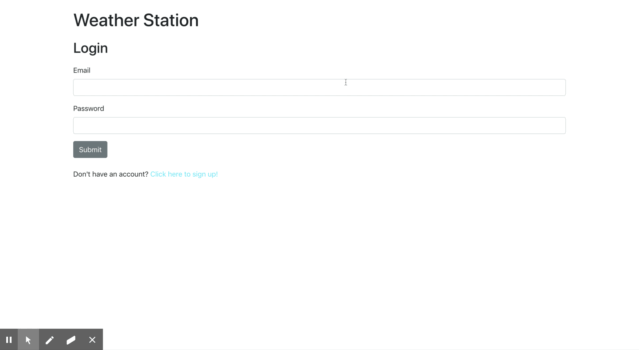

# Weather Station

Weather Station is an MVC CRUD weather application uses React for front-end, Node/Express for backend, and Postgres for databases management. It utilizes Google Geocoding API and Dark Sky API to find weather based on user input, and uses Json Web Tokens, password encryption, and protected React routes for User Authentication and Authorization. Frontend UI is Bootstrap plus a couple other open source packages, as well as a bit of custom CSS animation.

Check it out! You can search for and save weather information from any locality in the world...



## Technologies used

- React, Node.js + Express, Postgres + Knex
- Google Geocoding API and Dark Sky API
- JWT, Bcryptjs, client-side cookies
- Bootstrap UI + a couple component libraries

## Starting the app locally

Dependencies include:

- Local install of Postgres server and database

Git clone and while in the project root directory, create a file called .env in the project root directory, and add the following enviornment variables:

```
DB_USER=postgresUserName
DB_PW=dbPassword
DATABASE_URL=nameOfDatabseURLInProductionEnvironment
DARK_API=DarkSkyApiKey
GOOGLE_API=GeocodeApiKey
JWT_SECRET=yourAppsJWTSecretKey
```

While still in the project directory, run the following command:

```
npm install
```

This should install node modules within the server and the client folder.

After both installations complete, run the following command in your terminal:

```
npm start
```

Your app should now be running on <http://localhost:3000>. The Express server should intercept any API requests from the client.
